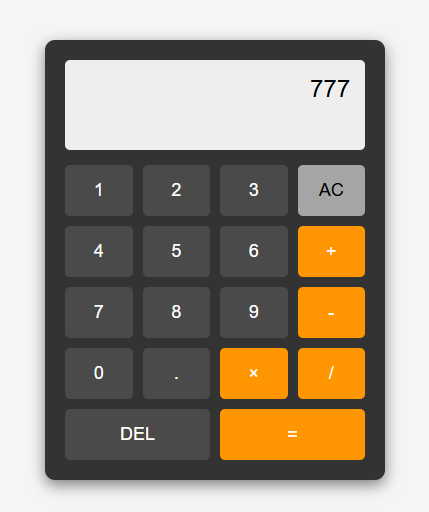

# Clean Architecture Calculator 🧮

Uma calculadora simples implementada em HTML, CSS e JavaScript, seguindo princípios de **Clean Architecture** para separação de responsabilidades.



## ✨ Funcionalidades
- Operações básicas: `+`, `-`, `*`, `/`
- Suporte a números decimais
- Tecla `DEL` para apagar dígitos
- Limpeza total com `AC`
- **Suporte a teclado** (números, operadores, Enter, Backspace, Escape)

## 🏗️ Estrutura do Projeto (Clean Architecture)

```bash
clean-architecture-calculator/
├── index.html # Estrutura básica HTML (apresentação)
├── js/
│ └── calculator.js # Lógica de negócio (operações matemáticas)
└── styles/
└── calculator.css # Estilos visuais (CSS puro)
```

### 📌 Princípios Aplicados
1. **Separação de preocupações**:
   - `index.html`: Camada de **apresentação** (apenas estrutura DOM).
   - `js/calculator.js`: Camada de **lógica** (cálculos, estados).
   - `styles/style.css`: Camada de **estilo** (design puro).

2. **Baixo acoplamento**:
   - Cada arquivo gerencia apenas sua responsabilidade.
   - JavaScript não manipula diretamente estilos, e CSS não define comportamentos.

3. **Reusabilidade**:
   - Componentes podem ser facilmente migrados para frameworks (ex: Angular, React, Vue).

## 🚀 Como Executar
1. Clone o repositório:
   ```bash
   git clone https://github.com/seu-usuario/clean-architecture-calculator.git